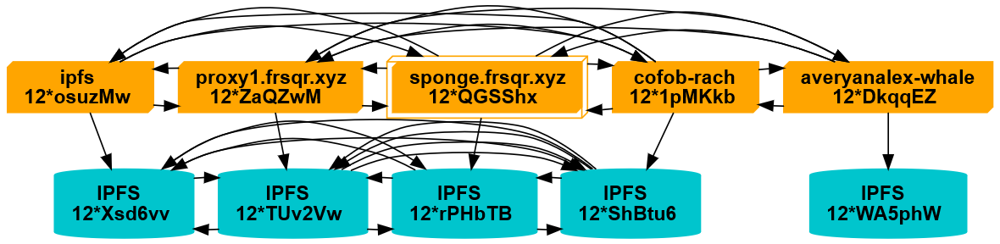

# Хостинг в IPFS

## Ситуация сегодня

### Мир с центром

"Сегодня интернет неэффективен и дорог" - гласит главная страница проекта [IPFS](https://ipfs.io/), и с этим трудно не согласиться. Огромные "облачные" провайдеры полностью уничтожили былую децентрализацию web 1.0, они хранят все наши данные и знают о вас практически всё. Они заправляют интернет, так что не удивительно, что отключение одного из них может привести к [отключению множества сайтов](https://dweb.link/ipfs/bafybeif4dzmlbw3hd6vmia4nqdr5wbhewfgwg6teljyrn2d2547tssylt4).

### Чем спасает IPFS?

Простыми словами IPFS - это торрент для веба. Замечали как быстро грузятся ваши фильмы в торренте? Всё из-за того что он распределяет нагрузку между множеством таких же как вы качал-фильмов. В IPFS всё так же. Если вы заходите на сайт с поддержкой IPFS и у вас он работает в фоне - вы подбираете этот сайт и начинаете помогать в его раздаче. Так же как и в торренте. А если у вас не установлен "торрент" то сайт всё равно продолжит работу, т.к. он загрузится по старому методу, - через "мост" или через веб-сервер.

То есть чем популярнее сайт, тем больше на нём нагрузка и тем больше он распространяется по земному шару. CDN ~~для бедных~~ для нового интернета.

## Мои отношения с ним

### Лёгкий вход

Услышав про это в первый раз я сразу побежал тестировать его, но на достаточно мощном сервере он съел весь процессор... 

Полгода спустя я вновь решил подойти к нему, но на этот раз более основательно. Читая документацию я наткнулся на сервис [web3.storage](https://web3.storage/) и тут моё мнение кардинально поменялось о проекте. Разработчики встроили максимально дружелюбную инфраструктуру для лёгкого входа в "децентрализованный мир", проект развивается, пора начинать вкатываться!

### В гостях хорошо, а

сервер под рукой - лучше. Не может быть децентрализации с центральным сервисом, поэтому собравшись с сообществом Yggdrasil мы запустили свой кластер из 5 (на момент написания) нод для совместного использования. ([граф кластера](https://i.frsqr.xyz/cluster/graph.txt))

### Что с ним можно делать?

На данный момент я использую его так:

- Как хостинг в CI/CD артефактах. Например при каждом коммите в этот блог создаётся [подобная ссылка](https://i.frsqr.xyz/ipfs/bafybeihldbjsuhipgmzhlosvb6sujcxbv422abryun5m6pgwbnuhkumndy).
- Как хостинг для настоящих сайтов. Этот блог полностью работает в сети IPFS, а Next.js поддерживает экспорт статических файлов.
- Для раздачи статики. (Вот, например, [мультик](https://ipfs.io/ipfs/QmXCqaWmKh8KQDiTW67M7Fvuhmu2Z6Bcwfa6JABPivHbFr?filename=mult.mkv))
- Хранилище для скриншотов. (Ну а почему нет?)
